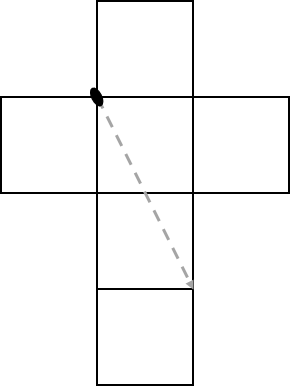

# Ant in Cubic Box Answer

**2.236 meters**

  

Flatten the box out to two dimensions and draw a line from one corner to the 
other. You can calculate the distance the ant walks using the Pythagorean 
Theorem and noting that the sides of the triangle are 2 meters and 1 meter.
