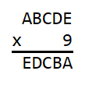
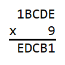
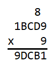
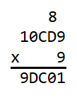
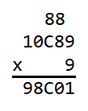
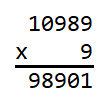

# Five Digit Number Times 9 Answer

**10989**

It is first helpful to make a list of the products of each digit multiplied by 
9.

|factors|product|
|:-----:|:-----:|
| 0 x 9 |   0   |
| 1 x 9 |   9   |
| 2 x 9 |  18   |
| 3 x 9 |  27   |
| 4 x 9 |  36   |
| 5 x 9 |  45   |
| 6 x 9 |  54   |
| 7 x 9 |  63   |
| 8 x 9 |  72   |
| 9 x 9 |  81   |

Starting at the beginning, we see that 

 

In order for the product EDCBA to be five digits, A must be 1 so that in the 
ten thousands column A x 9 is a non-zero, single digit number. We now have 

 

With A being 1, E must be 9 because in the ten thousands column 1 x 9 is 9. 
This is corroborated in the ones column because 9 x 9 ends in a 1. Carrying an 
8 into the tens column we have 

 

In the thousands column B x 9 must be a single digit number so that nothing is 
carried over into the ten thousands column. This means that B must be either 0 
or 1. The other condition comes from the tens column in which D x 9 + 8 must 
end in B. If B were 1, that would mean that D must be 7 because 7 x 9 + 8 is 
71. However, from the thousands column if B were 1, D would have to be 9 
because 1 x 9 is 9. Because C cannot be both 7 and 9, B cannot be 1 and must be 
0. We now have 

 

Because B is 0, in the tens column D x 9 + 8 must end in a 0. This means that D 
x 9 must end in a 2 and therefore D must be 8 in which 8 x 9 + 8 is 80. 
Carrying the 8 into the hundreds column we have 

 

In the thousands column we see that an 8 needs to be carried over from the 
hundreds column so that 0 x 9 + 8 is 8. This means that in the hundreds column 
C x 9 + 8 must begin with a 8 and also must end with a C. In order for C x 9 + 
8 to begin with an 8, C must be either 8 or 9. If C were 8, 8 x 9 + 8 is 80 in 
which the last digit is not 8. This means that C is not 8 and must be 9. We can 
see that 9 x 9 + 8 is 89 in which the last digit is 9. In the end we see that 
the answer is 10989 and we have 

 
