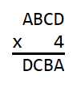
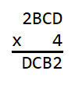
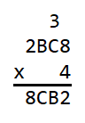
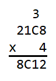
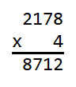

# Four Digit Number Times 4 Answer

**2178**

It is first helpful to make a list of the products of each digit multiplied by 
4.

|factors|product|
|:-----:|:-----:|
| 0 x 4 |   0   |
| 1 x 4 |   4   |
| 2 x 4 |   8   |
| 3 x 4 |  12   |
| 4 x 4 |  16   |
| 5 x 4 |  20   |
| 6 x 4 |  24   |
| 7 x 4 |  28   |
| 8 x 4 |  32   |
| 9 x 4 |  36   |

Starting at the beginning, we see that 

 

In order for the product DCBA to be four digits, A must be either 1 or 2 so 
that in the thousands column A x 4 is not greater than 9. In the ones column, 
the last digit of D x 4 must end with A (1 or 2). Looking at the table above we 
see that no product ends with a 1, so A must be 2. We now have 

 

Because A is 2, D must now be either 3 or 8 so that in the ones column D x 4 
ends with a 2. In the thousands column, D cannot be less than 8 because 2 x 4 
is 8. This means that D must be 8. Carrying a 3 into the tens column we have 

 

Because D is 8 and not 9 in the thousands column, B x 4 in the hundred column 
must result in a single digit number so that nothing is carried over into the 
thousands column. This means that B must be 0, 1, or 2. The other condition is 
that in the tens column C x 4 + 3 must end with B. From the table above we see 
that C x 4 always ends in an even number, so C x 4 + 3 will always end in an 
odd number. This means that B must be odd and therefore must be 1. We now have 

 

Because B is 1 so that in the tens column C x 4 + 3 must end in a 1, C x 4 must 
end in an 8. This means that C must be either 2 or 7. However, C cannot be less 
than 4 because in the hundreds column 1 x 4 is 4. This means that C must be 7. 
In the end we see that the answer is 2178 and we have 

 
