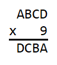
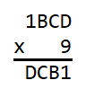
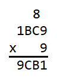
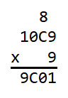
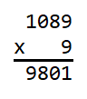

# Four Digit Number Times 9 Answer

**1089**

It is first helpful to make a list of the products of each digit multiplied by 
9.

|factors|product|
|:-----:|:-----:|
| 0 x 9 |   0   |
| 1 x 9 |   9   |
| 2 x 9 |  18   |
| 3 x 9 |  27   |
| 4 x 9 |  36   |
| 5 x 9 |  45   |
| 6 x 9 |  54   |
| 7 x 9 |  63   |
| 8 x 9 |  72   |
| 9 x 9 |  81   |

Starting at the beginning, we see that 

 

In order for the product DCBA to be four digits, A must be 1 so that in the 
thousands column A x 9 is a non-zero, single digit number. We now have 

 

With A being 1, D must be 9 because in the thousands column 1 x 9 is 9. This is 
corroborated in the ones column because 9 x 9 ends in a 1. Carrying an 8 into 
the tens column we have 

 

In the hundreds column B x 9 must be a single digit number so that nothing is 
carried over into the thousands column. This means that B must be either 0 
or 1. If B were 1, that would mean that C must be 9 because in the hundreds 
column 1 x 9 is 9. The answer would then be 1199, however 1199 x 9 is not 9911. 
This means that B cannot be 1, and must be 0. We now have 

 

Because B is 0, in the tens column C x 9 + 8 must end in a 0. This means that C 
x 9 must end in a 2 and therefore C must be 8. In the end we see that the 
answer is 1089 and we have 

 
