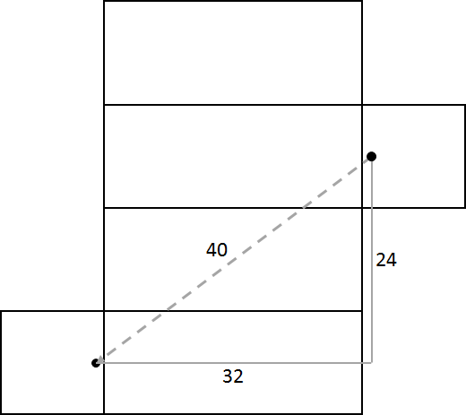

# Spider and Fly Answer

**40 feet**

  

Flatten the box out to two dimensions and draw a line from the spider to the 
fly. The box can be flattened in different ways, but the picture above gives 
the shortest path for the spider. You can calculate the distance the spider 
walks using the Pythagorean Theorem and noting that the sides of the triangle 
are 32 feet and 24 feet.
