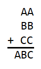
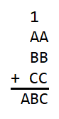
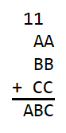
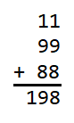

# Three Number Addition Answer

**A = 1, B = 9, C = 9**

Initially we have 

  

In the ones column we see that A + B + C must end in a C, so A + B must end in 
a 0. For A + B to end in a 0, A + B must equal 10. Carrying the 1 into the tens 
column we have 

  

In the tens column we see that 1 + A + B + C must end in a B, so 1 + A + C must 
end in a 0. For 1 + A + C to end in a 0, 1 + A + C must equal 10. Carrying the 
1 into the hundreds column we have 

  

In the hundred column we see that A must be 1. From before we know that A + B 
must equal 10, so B must be 9. We also know that 1 + A + C must equal 10, so C 
must be 8. In the end we see that 

  
