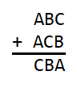
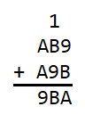
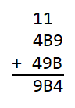
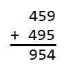

# Two Number Addition Answer

**A = 4, B = 5, C = 9**

Initially we have 

  

In the tens column we see that B + C plus a possible carry-over from the ones 
column must end in a B. For this to happen C must be 0 with no carry-over or 
the carry-over plus C must end in a 0. In the hundreds column we see that A + A 
plus a possible carry-over from the tens column sums to C. The sum of A + A 
plus a possible carry-over cannot sum to 0, so C cannot be 0. This means that C 
plus a carry-over into the tens column must end in a 0. The only possible 
carry-over from the ones column is a 1, so C must be 9 so that 1 + 9 equals 10 
which ends in a 0. With a carry-over of 1 from the ones column we have 

  

In the hundreds column we see that A + A plus a possible carry-over from the 
tens column must sum to 9. In order for the hundreds column to sum to 9, there 
must be a carry-over of an odd number from the tens column. The only possible 
carry-over is a 1 which means that A must be 4. We now have 

  

In the ones column we see that 9 + B is 14, so B must be 5. This is supported 
by the tens column in which 1 + 5 + 9 is 15, which ends in a 5. In the end we 
see that 

  
